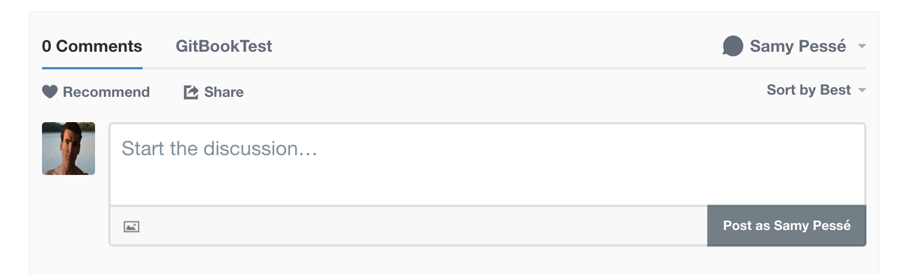

# Disqus comments for GitBook



To use the Disqus plugin in your Gitbook project, add the disqus plugin to the `book.json` file, along with your shortname (you create a shortname for disqus by creating a new website on the [disqus.com](https://disqus.com/) website)

```
{
    "plugins": ["disqus"],
    "pluginsConfig": {
        "disqus": {
            "shortName": "XXXXXXX"
        }
    }
}
```

### Use custom page identifiers

By default Disqus use the window URL as the main identifier when creating a thread. You can set a custom identifier in the YAML frontmatter of your page:

```md
---
disqus:
  identifier: "some-identifier"
---
```
